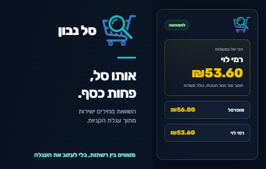
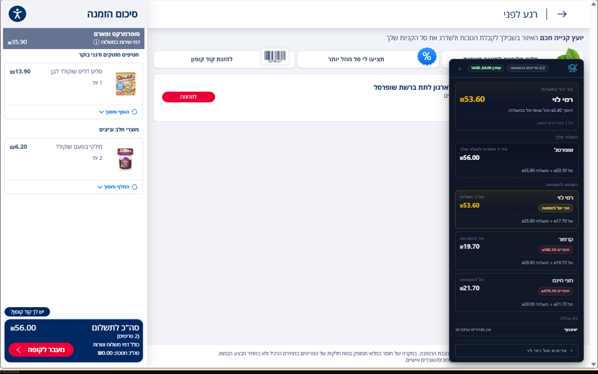

<div align="center">

# Sal Navon · סל נבון

**אותו סל, פחות כסף.**

Same cart. Less money.



Compare your grocery cart across Israeli supermarket chains, right where you shop.

[**Install from Chrome Web Store**](https://chromewebstore.google.com/detail/%D7%A1%D7%9C-%D7%A0%D7%91%D7%95%D7%9F/jkhkopflbogmpgkcgabmkmjfkbhbclcj?hl=iw)

[Local development](#local-development) · [Privacy policy](PRIVACY.md)

</div>

## Your Cart, Compared

Already filled your online grocery cart? Sal Navon reads the products and
quantities on supported cart pages and shows how their prices compare at other
chains, without rebuilding your shopping list.

- **Compare the same products.** Barcode matching, with no guessed substitutions.
- **See delivery and pickup costs.** Fulfillment fees are included when available.
- **Understand the gaps.** Unmatched items and minimum-order requirements are
  surfaced alongside the comparison.
- **Stay on the cart page.** The Chrome extension displays the comparison directly
  on supported supermarket sites.

## How It Works

1. [Install Sal Navon from the Chrome Web Store](https://chromewebstore.google.com/detail/%D7%A1%D7%9C-%D7%A0%D7%91%D7%95%D7%9F/jkhkopflbogmpgkcgabmkmjfkbhbclcj?hl=iw).
2. Open your cart on Shufersal, Rami Levi, or Hazi Hinam.
3. Review the comparison widget for prices, delivery or pickup options, and
   missing items.

### Supported Chains

| Chain | Compare from its cart page | Price data collected |
| --- | :---: | :---: |
| Shufersal | ✓ | ✓ |
| Rami Levi | ✓ | ✓ |
| Hazi Hinam | ✓ | ✓ |
| Carrefour | — | ✓ |
| Yohananof | — | ✓ |

Comparison availability depends on current price data and configured online
stores. Products outside the shared barcode-matched set are shown as unmatched;
delivery or pickup options below the minimum order are shown as unavailable.
Final prices and fulfillment terms are determined by each supermarket.

<details>
<summary>See the extension in action</summary>



</details>

## Under the Hood

Chain-specific **Python scrapers** download public store and price XML feeds,
normalize products and prices, and load them into **Supabase/Postgres**. A
**FastAPI API** compares cart barcodes and quantities against configured online
stores. The **Chrome extension** reads the active cart and displays the results.

## Repository Layout

- `app/api/` - FastAPI app, request/response models, comparison logic.
- `app/db/` - Postgres repository and seed helpers.
- `app/scrapers/` - shared scraper code and chain-specific implementations.
- `extension/` - Chrome extension source.
- `supabase/migrations/` - database schema migrations.
- `.github/workflows/scrape-prices.yml` - scheduled scraper workflow.
- `.github/workflows/deploy-api.yml` - Cloud Run API deployment workflow.
- `Dockerfile` - API container image for Cloud Run.

## Local Development

Requirements:

- Python `>=3.10`.
- `uv` for dependency management.
- A Supabase/Postgres database matching `supabase/migrations/`.
- Chrome or Chromium for extension testing.

Install dependencies:

```bash
uv sync
```

Run the API:

```bash
uv run uvicorn app.api.main:app --reload
```

Check health:

```bash
curl http://127.0.0.1:8000/health
curl http://127.0.0.1:8000/ready
```

Lint and format:

```bash
uv run ruff check .
uv run black .
```

## Environment

Copy `.env.example` to `.env` for local development.

Important API variables:

- `DATABASE_URL` - Postgres connection string. Production should use a read-only
  API role.
- `ALLOWED_EXTENSION_ORIGINS` - comma-separated Chrome extension origins allowed
  to call `/api/compare`.
- `MAX_COMPARE_BARCODES`, `MAX_BARCODE_LENGTH`, `MAX_ITEM_QUANTITY` - request
  size limits for API protection.
- `DATABASE_POOL_MIN_SIZE`, `DATABASE_POOL_MAX_SIZE` - Postgres pool size per
  API instance. Production currently caps this at `1..3` connections per Cloud
  Run instance.
- `DATABASE_STATEMENT_TIMEOUT_MS` - Postgres statement timeout for API requests.
  Do not set this for scraper jobs that perform bulk writes.
- `READY_CACHE_SECONDS` - short cache window for the DB-backed `/ready` check.
- `ALLOW_LOCAL_ORIGINS` - optional local development CORS/origin override. Do
  not enable it in production.

Scraper jobs should use a separate write-capable database role.

## Scraping Data

Run a delta scrape where supported:

```bash
uv run python -m app.main
```

Force full price files for every chain:

```bash
uv run python -m app.main --force-full
```

The scraper downloads XML files locally and writes parsed products/prices to the
database. XML downloads and `chains_downloads/` are local artifacts and should
not be committed.

Production scraping runs from a GitHub self-hosted Windows runner on a local
Israeli network because some supermarket price sites block cloud/datacenter
traffic. The workflow supports scheduled delta runs, scheduled full runs, manual
runs, scraper log artifacts, and optional completion emails.

Email notifications use SMTP when these GitHub settings are configured:

- Secrets: `SMTP_HOST`, `SMTP_PORT`, `SMTP_USERNAME`, `SMTP_PASSWORD`.
- Variables: `SCRAPE_MAIL_FROM`, `SCRAPE_MAIL_TO`.

For Gmail, use an app password with `SMTP_HOST=smtp.gmail.com` and
`SMTP_PORT=587`.

## Browser Extension

[Install from Chrome Web Store](https://chromewebstore.google.com/detail/%D7%A1%D7%9C-%D7%A0%D7%91%D7%95%D7%9F/jkhkopflbogmpgkcgabmkmjfkbhbclcj?hl=iw).

For local development, load the extension from source:

1. Open `chrome://extensions`.
2. Enable Developer Mode.
3. Click Load unpacked.
4. Select the `extension/` directory.

After changing `manifest.json` or `background.js`, reload the extension card and
refresh the supermarket cart page.

The API URL is currently hardcoded in `extension/background.js`, and the same
Cloud Run URL must be present in `extension/manifest.json` under
`host_permissions`.

## Production

The API runs on Google Cloud Run as `supermarket-comparison-api` in
`europe-west1`. Pushes to `main` automatically deploy the API when API,
database-access, dependency, Docker, `.gcloudignore`, or deployment workflow
files change. The workflow can also be run manually from GitHub Actions.

Production guardrails currently in place:

- Cloud Run max instances are capped at `3`.
- Cloud Run concurrency is capped at `3` to match the API DB pool max.
- API DB pool max is capped at `3` connections per instance.
- API request size limits are enforced before DB queries.
- Postgres statement timeout is configured for API requests.
- `DATABASE_URL` is loaded from GCP Secret Manager secret `SUPABASE_DB_URL`.
- Origin filtering only allows configured Chrome extension origins.

Operational checks:

```bash
curl https://YOUR_CLOUD_RUN_URL/health
curl https://YOUR_CLOUD_RUN_URL/ready
uv run ruff check .
```

Origin filtering is useful for the Chrome extension, but it is not full public
API authentication. For a wider public launch, add stronger abuse protection or
rate limiting if traffic starts to become expensive.

## Database

Schema changes belong in `supabase/migrations/`. The comparison API expects
products, prices, stores, shipping costs, and configured compare stores to be
present.

The API should only need read permissions. Scraping and seed commands need write
permissions.
